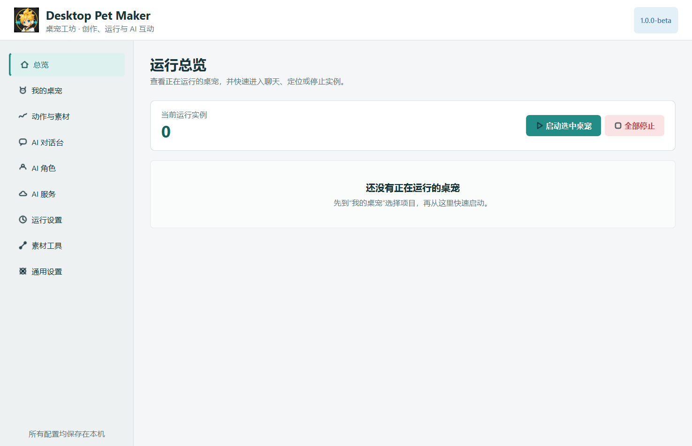
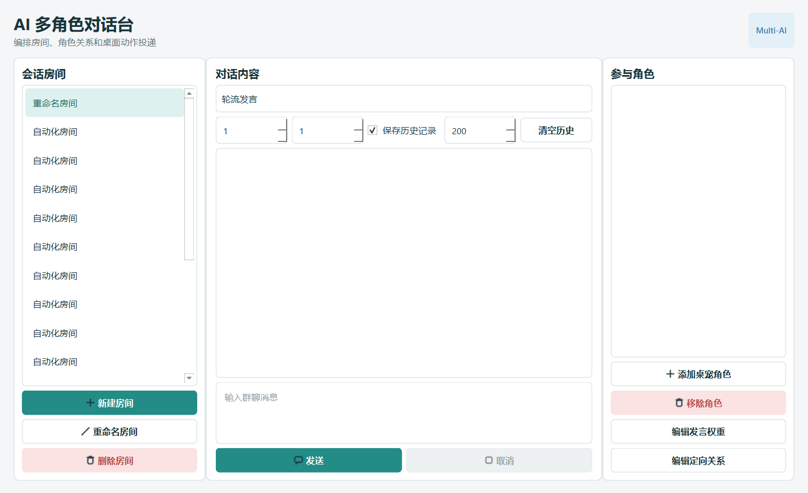
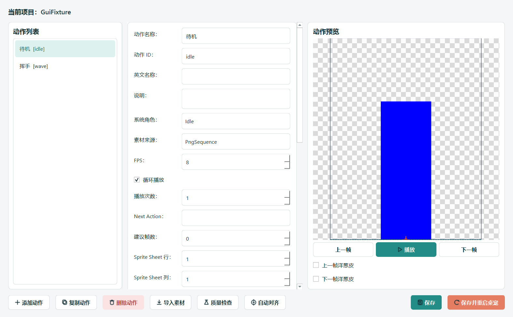
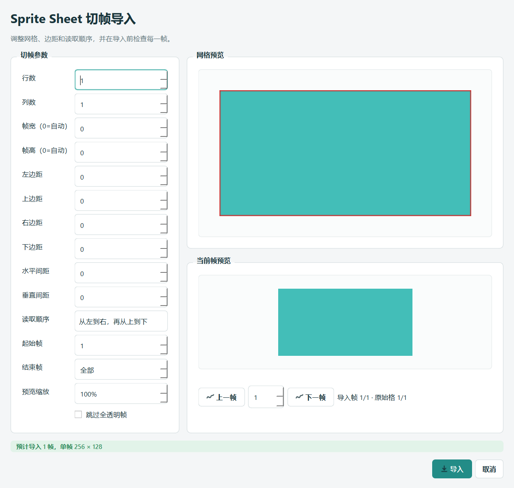

<p align="center">
  
</p>

<p align="center">
  使用 Qt/C++ 构建的桌宠制作、运行与 AI 互动平台
</p>

<p align="center">
  <strong>Windows · Qt 6 · C++17 · CMake</strong>
</p>

# Desktop Pet Maker

Desktop Pet Maker 是一个桌面宠物制作与运行工具。它不仅能运行透明桌宠，还提供动画素材编辑、PNG/GIF/Sprite Sheet 导入、动作状态机、AI 角色配置、多角色对话和运行时管理。

项目仍处于 `1.0.0-beta` 阶段，核心功能已经可以构建和测试，部分真实桌面体验仍需要人工验收。

## 界面预览

### 桌宠管理中心



<details>
<summary>查看更多界面</summary>

### AI 多角色对话台



### 动作与素材工作台



### Sprite Sheet 切帧导入



</details>

## 主要能力

- **桌宠运行时**：透明窗口、拖拽、掉落、弹跳、巡逻、鼠标跟随、位置锁定、鼠标穿透和窗口置顶。
- **动作系统**：待机、点击、睡眠、走路以及可扩展的项目动作；支持 FPS、循环、Next Action、镜像和帧缓存。
- **素材工作流**：导入 PNG 序列、GIF、Sprite Sheet、Shimeji 素材和 `.petpack`。
- **桌宠制作器**：统一画布、锚点、状态偏移、帧偏移、动画预览和素材质量检查。
- **AI 互动**：OpenAI-compatible Provider、每宠物独立角色提示词、主动聊天气泡和安全的运行时动作联动。
- **Multi-AI**：房间、参与角色、轮流发言、定向关系、历史记录和桌面动作投递。
- **管理中心**：管理桌宠项目、运行实例、AI 服务、角色配置和通用运行设置。
- **可靠性**：字段级运行状态保存、`QSaveFile` 原子写入、Anchor 地面坐标和多屏幕位置修正。

## 架构概览

```text
Desktop Pet Maker
├─ PetControlCenterWindow       桌宠管理中心
├─ RuntimePetManager            正常模式生命周期管理
├─ RuntimePetWindow             唯一正式 Qt/C++ 桌宠运行时
├─ PetProject                   pet.json / petpack 数据模型
├─ EditorWindow                 桌宠素材与动作编辑器
├─ AIProvider                   OpenAI-compatible 网络协议层
├─ AIDialogWindow               单桌宠完整聊天窗口
├─ PetSpeechBubbleWindow        主动 AI 消息气泡
└─ AIConversationRoomManager    多角色 AI 会话协调
```

更完整的当前架构事实请查看 [CURRENT_PROJECT_STATE.md](CURRENT_PROJECT_STATE.md)。

## 构建

### 环境要求

- Windows 10/11
- CMake 3.22+
- Qt 6，包含 `Widgets`、`Network` 和 `Test`
- 支持 C++17 的编译器
- Python 3，用于项目检查和部分打包脚本

### 编译

```powershell
cmake -S . -B build -DCMAKE_PREFIX_PATH="C:/Qt/6.x.x/<toolchain>"
cmake --build build --config Release
```

启动管理中心：

```powershell
.\build\pro.exe --control-center
```

CLI 多桌宠调试：

```powershell
.\build\pro.exe path\to\petA\pet.json path\to\petB\pet.json
```

## 测试

```powershell
ctest --test-dir build -C Release --output-on-failure
python tools/check_text_encoding.py --root .
python tools/verify_source_manifest.py --root . --manifest SOURCE_MANIFEST_SHA256.txt
```

公开源码包的 Release 基线为 `28/28 PASS`。真实多显示器、干净 Windows 虚拟机、托盘交互和主观动画质量仍属于人工测试范围。

## 项目目录

```text
.
├─ tests/                Qt 自动化与回归测试
├─ tools/                编码、清单、打包和签名工具
├─ ui/theme/             统一主题、颜色和图标系统
├─ resources/branding/   应用图标与品牌资源
├─ docs/images/          GitHub 展示截图
├─ licenses/             第三方组件许可证与清单
├─ CMakeLists.txt
└─ main.cpp
```

## AI 配置与安全

- API Key 不会写入 `pet.json` 或 `.petpack`。
- Windows 正式运行时通过 Credential Store 保存凭据。
- DeepSeek V4 请求使用非思考模式。
- API 错误详情不会污染桌宠对话历史。
- 提交前请运行 Secret 扫描，不要上传真实 API Key、Bearer Token 或本机配置。

## 素材与授权说明

- 仓库中的桌宠角色素材、可选示例和品牌图标必须分别确认授权后才能用于公开发行。
- 公开源码包和 Windows 测试版使用项目原创的黄色几何桌宠图标，可随 Desktop Pet Maker 修改与再分发。
- 用户导入或分发的角色素材、字体、模型和声音仍需由用户自行确认授权。
- 详细记录见 [ASSET_PROVENANCE.md](ASSET_PROVENANCE.md)、[ASSET_LICENSES.json](ASSET_LICENSES.json) 和 [THIRD_PARTY_NOTICES.md](THIRD_PARTY_NOTICES.md)。

## 当前边界

- Live2D 目前只有适配边界和安全降级，不包含 Cubism SDK 渲染器。
- Authenticode 签名脚本已提供，但没有配置签名证书。
- 没有实现跨进程持久聊天记忆。
- 项目代码尚未选择最终开源许可证；公开协作前应由仓库所有者确认许可证。

## 参与项目

请先阅读 [CONTRIBUTING.md](CONTRIBUTING.md)。安全问题请参阅 [SECURITY.md](SECURITY.md)。

历史审查报告保留在本地 `docs/archive/`，不作为当前通过证书。当前事实以 [CURRENT_PROJECT_STATE.md](CURRENT_PROJECT_STATE.md) 为准。
